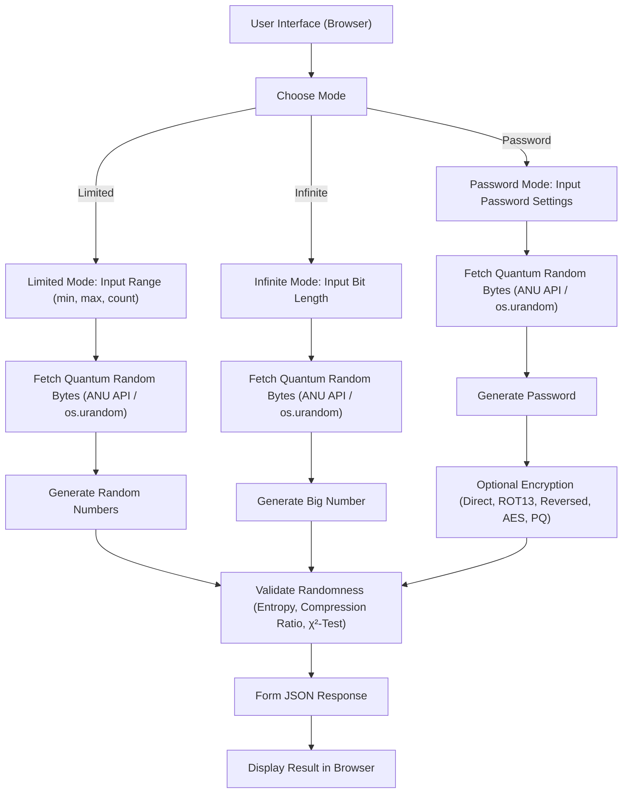

# 🎲 Quantum True Random Generator


[en English version](README_EN.md)

Это веб-приложение предоставляет гибкий интерфейс для генерации **истинно случайных чисел** с использованием квантовой энтропии, получаемой с [ANU Quantum Random Numbers Server](https://qrng.anu.edu.au/). Приложение реализует несколько режимов генерации и шифрования, включая демонстрационное постквантовое шифрование (PQ) на основе алгоритма Kyber и AES-GCM.



---

## 🚀 Возможности

- **Режимы генерации:**
  - **Limited Range:** Генерация чисел в заданном диапазоне (min–max).
  - **Infinite:** Генерация одного большого числа с указанной битовой длиной.
  - **Password:** Генерация случайного пароля с возможностью выбора сложности.

- **Форматы вывода:**  
  Поддерживаются Decimal, Hex, Binary и Base64.

- **Методы шифрования для пароля:**
  - **Direct:** Без шифрования.
  - **ROT13:** Простейшее симметричное преобразование.
  - **Reversed:** Реверс строки.
  - **AES:** Шифрование с использованием AES-CBC (PKCS7).
  - **PQ (Kyber + AES-GCM):** Постквантовое шифрование с использованием алгоритма Kyber (через [kyber-py](https://pypi.org/project/kyber-py/)) для инкапсуляции ключа и AES-GCM для симметричного шифрования.

- **Квантовая энтропия:**  
  Для генерации случайных чисел используется API квантового генератора ANU. При недоступности API применяется `os.urandom`.

- **Валидация случайности:**  
  Выполняется расчет энтропии, коэффициента сжатия (с помощью zlib) и теста χ² для оценки качества данных.

- **Современный веб-интерфейс:**  
  Реализовано на [FastAPI](https://fastapi.tiangolo.com/) с сервером [Uvicorn](https://uvicorn.org/), оформлено с использованием [Tailwind CSS](https://tailwindcss.com/) и визуализируется распределение с помощью [Chart.js](https://www.chartjs.org/).

---

## Математические основы

### Энтропия (Shannon Entropy)

Формула:
```
H = -∑( pᵢ * log₂(pᵢ) )
```
где `pᵢ` — вероятность появления i-го байта. Чем ближе `H` к 8 бит/байт, тем более случайны данные.

### Коэффициент сжатия

Коэффициент сжатия вычисляется так:
```
C = (размер сжатых данных) / (исходный размер)
```
Значение, близкое к 1, говорит о том, что данные плохо сжимаются и, следовательно, более случайны.

### χ²-тест

Для проверки равномерности распределения:
```
χ² = ∑( (Oᵢ - E)² / E )
```
где `Oᵢ` — наблюдаемое количество, а `E` — ожидаемое (при равномерном распределении). Чем ближе результат к табличному значению для заданной степени свободы, тем выше вероятность равномерного распределения.

## 🛠️ Установка и запуск

1. **Клонируйте репозиторий:**

   ```bash
   git clone https://github.com/your_username/Quantum_Random_Generator.git
   cd Quantum_Random_Generator
   ```

2. **Создайте и активируйте виртуальное окружение (рекомендуется Python 3.10 или 3.11):**

   - Windows:
     ```bash
     python -m venv venv
     venv\Scripts\activate
     ```
   - Linux/Mac:
     ```bash
     python3 -m venv venv
     source venv/bin/activate
     ```

3. **Установите зависимости:**

   ```bash
   pip install -r requirements.txt
   ```

   *requirements.txt*:
   ```txt
   fastapi
   uvicorn[standard]
   aiohttp
   kyber-py
   cryptography
   pydantic
   ```

4. **Запустите сервер:**

   ```bash
   uvicorn main:app --reload
   ```

5. **Откройте приложение в браузере:**  
   Перейдите по адресу [http://127.0.0.1:8000](http://127.0.0.1:8000)

---

## 🔒 Квантовые и постквантовые технологии

- **Квантовая энтропия:**  
  Используется для генерации истинно случайных чисел, основанных на квантовых процессах.

- **Постквантовое шифрование:**  
  Режим PQ демонстрирует гибридное шифрование: Kyber (через kyber-py) используется для инкапсуляции ключа, после чего общий секрет обрабатывается через SHA256 для получения симметричного ключа, который применяется в AES-GCM. Это помогает повысить устойчивость системы к квантовым атакам.

- **Возможные расширения:**  
  В будущем можно интегрировать квантовое распределение ключей (QKD) и другие квантово-устойчивые протоколы для обмена секретами.

---

Разработано с ❤️ для экспериментов, исследований в области криптографии и квантовой случайности.
