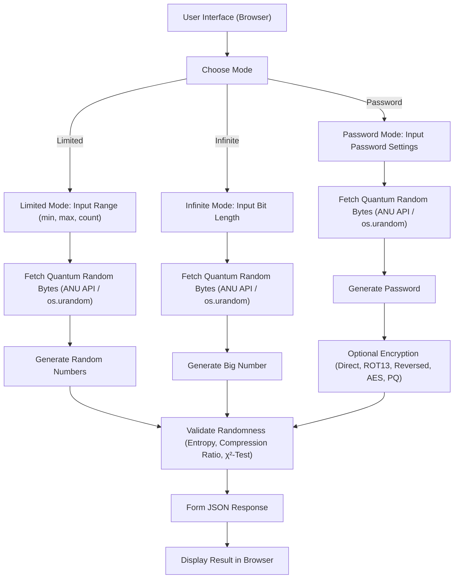

# 🎲 Quantum True Random Generator


[Русская версия](README.md)
> [!CAUTION]
> :warning: **Under no circumstances should this be used for cryptographic
applications.** :warning:
> 
> This is an educational resource and has not been designed to be secure
> against any form of side-channel attack. The intended use of this project
> is for learning and experimenting with ML-KEM and Kyber

This web application provides a flexible interface for generating **truly random numbers** using quantum entropy obtained from the [ANU Quantum Random Numbers Server](https://qrng.anu.edu.au/). The application implements multiple generation modes and encryption methods, including a demonstration of post-quantum encryption (PQ) based on the Kyber algorithm and AES-GCM.



---

## 🚀 Features

- **Generation Modes:**
  - **Limited Range:** Generate numbers within a user-defined range (min–max).
  - **Infinite:** Generate one large number with a specified bit-length.
  - **Password:** Generate a random password with selectable complexity.

- **Output Formats:**  
  Supported formats include Decimal, Hex, Binary, and Base64.

- **Password Encryption Methods:**
  - **Direct:** No encryption.
  - **ROT13:** A simple symmetric transformation.
  - **Reversed:** Reverse the string.
  - **AES:** Encryption using AES-CBC with PKCS7 padding.
  - **PQ (Kyber + AES-GCM):** Post-quantum encryption using the Kyber algorithm (via [kyber-py](https://pypi.org/project/kyber-py/)) for key encapsulation and AES-GCM for symmetric encryption.

- **Quantum Entropy:**  
  Quantum random bytes are fetched from the ANU API. If the API is unavailable, the system falls back to `os.urandom`.

- **Randomness Validation:**  
  The system computes entropy, compression ratio (using zlib), and performs a χ²-test to assess data quality.

- **Modern Web Interface:**  
  Built with [FastAPI](https://fastapi.tiangolo.com/) and served with [Uvicorn](https://uvicorn.org/), styled using [Tailwind CSS](https://tailwindcss.com/), and includes data visualization via [Chart.js](https://www.chartjs.org/).

---

## 📐 Mathematical Foundations

### Shannon Entropy

The entropy is computed using the formula:

```
H = -∑( pᵢ * log₂(pᵢ) )
```

where `pᵢ` is the probability of occurrence for the i-th byte. An entropy close to 8 bits/byte indicates highly random data.

### Compression Ratio

The compression ratio is calculated as:

```
C = (compressed data size) / (original data size)
```

A value close to 1 indicates that the data is poorly compressible, implying high randomness.

### χ²-Test

The χ²-test is applied to check the uniformity of the distribution:

```
χ² = ∑( (Oᵢ - E)² / E )
```

where `Oᵢ` is the observed count and `E` is the expected count under a uniform distribution. A result close to the tabulated value for a given degree of freedom suggests a uniform distribution.

---

## 🛠️ Installation and Running

1. **Clone the repository:**

   ```bash
   git clone https://github.com/your_username/Quantum_Random_Generator.git
   cd Quantum_Random_Generator
   ```

2. **Create and activate a virtual environment (recommended: Python 3.10 or 3.11):**

   - Windows:
     ```bash
     python -m venv venv
     venv\Scripts\activate
     ```
   - Linux/Mac:
     ```bash
     python3 -m venv venv
     source venv/bin/activate
     ```

3. **Install dependencies:**

   ```bash
   pip install -r requirements.txt
   ```

   *requirements.txt*:
   ```txt
   fastapi
   uvicorn[standard]
   aiohttp
   kyber-py
   cryptography
   pydantic
   ```

4. **Run the server:**

   ```bash
   uvicorn main:app --reload
   ```

5. **Open the application in your browser:**  
   Navigate to [http://127.0.0.1:8000](http://127.0.0.1:8000)

---

## 🔒 Quantum and Post-Quantum Technologies

- **Quantum Entropy:**  
  Utilized to generate truly random numbers based on quantum processes.

- **Post-Quantum Encryption:**  
  The PQ mode demonstrates a hybrid encryption scheme where Kyber (via kyber-py) is used for key encapsulation, and the shared secret is processed via SHA256 to derive a symmetric key used by AES-GCM. This approach enhances the system's resilience against quantum attacks.

- **Future Extensions:**  
  In the future, quantum key distribution (QKD) and other quantum-resistant protocols could be integrated for secure key exchange.

---

Developed with ❤️ for experimentation, cryptographic research, and quantum randomness.
