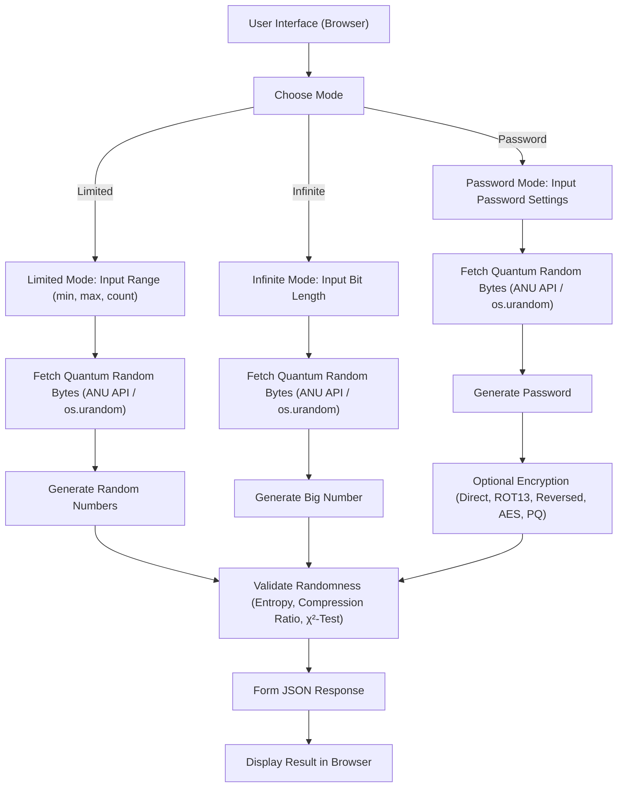

# 🎲 Quantum True Random Generator


[Русский version](README.md)

This web application provides a flexible interface for generating **truly random numbers** using quantum entropy obtained from the [ANU Quantum Random Numbers Server](https://qrng.anu.edu.au/). The project implements multiple generation modes and encryption methods, including a demonstration of post-quantum encryption (PQ) based on the Kyber algorithm and AES-GCM.



---

## 🚀 Features

- **Generation Modes:**
  - **Limited Range:** Generate numbers within a user-defined range (min–max).
  - **Infinite:** Generate one large number with a specified bit-length.
  - **Password:** Generate a random password with selectable complexity.

- **Output Formats:**  
  Supports Decimal, Hex, Binary, and Base64.

- **Password Encryption Methods:**
  - **Direct:** No encryption.
  - **ROT13:** A simple symmetric transformation.
  - **Reversed:** Reverses the string.
  - **AES:** Encryption using AES-CBC with PKCS7 padding.
  - **PQ (Kyber + AES-GCM):** Post-quantum encryption that uses Kyber (via kyber-py) for key encapsulation and AES-GCM for symmetric encryption.

- **Quantum Entropy:**  
  The application retrieves quantum random bytes from the ANU server. If the API is unavailable, it falls back to `os.urandom`.

- **Randomness Validation:**  
  The application computes entropy, compression ratio (using zlib), and performs a χ²-test to evaluate data quality.

- **Modern Web Interface:**  
  Built with [FastAPI](https://fastapi.tiangolo.com/) and [Uvicorn](https://uvicorn.org/), styled using [Tailwind CSS](https://tailwindcss.com/), with distribution visualization powered by [Chart.js](https://www.chartjs.org/).

---

## 🛠️ Installation and Running

1. **Clone the repository:**

   ```bash
   git clone https://github.com/your_username/Quantum_Random_Generator.git
   cd Quantum_Random_Generator
   ```

2. **Create and activate a virtual environment (recommended Python 3.10 or 3.11):**

   - Windows:
     ```bash
     python -m venv venv
     venv\Scripts\activate
     ```
   - Linux/Mac:
     ```bash
     python3 -m venv venv
     source venv/bin/activate
     ```

3. **Install dependencies:**

   ```bash
   pip install -r requirements.txt
   ```

   *requirements.txt*:
   ```txt
   fastapi
   uvicorn[standard]
   aiohttp
   kyber-py
   cryptography
   pydantic
   ```

4. **Run the server:**

   ```bash
   uvicorn main:app --reload
   ```

5. **Open the application in your browser:**  
   Navigate to [http://127.0.0.1:8000](http://127.0.0.1:8000)

---

## 📐 How It Works

- **Random Number Generation:**  
  The application requests quantum random bytes from the ANU server. If the API is unavailable, it uses `os.urandom` as a fallback.

- **"Password" Mode:**  
  A random password is generated based on a chosen character set (low, medium, or high complexity). After generation, the password can be encrypted using one of the methods:
  - **AES:** Encrypts using AES-CBC.
  - **PQ (Kyber + AES-GCM):** Demonstrates post-quantum encryption where Kyber (via kyber-py) encapsulates a key and the shared secret is used (after SHA256 derivation) with AES-GCM to encrypt the password.

- **Validation:**  
  The application calculates entropy, compression ratio, and performs a χ²-test to assess the quality of the random data.

---

## 🔒 Quantum and Post-Quantum Technologies

- **Quantum Entropy:**  
  Utilized to generate truly random numbers based on quantum processes.

- **Post-Quantum Encryption:**  
  The PQ mode demonstrates a hybrid encryption scheme where Kyber (via kyber-py) is used for key encapsulation and AES-GCM is applied for symmetric encryption. This approach enhances the system's resilience against quantum attacks.

- **Potential Extensions:**  
  Future enhancements could include integrating Quantum Key Distribution (QKD) or other quantum-resistant protocols for secure key exchange.

---

## 📋 Additional Enhancements

- **Logging:**  
  The application logs errors (for example, if the quantum API is unavailable).

- **Flexible Configuration:**  
  Users can choose the generation mode, output format, password complexity, and encryption method via the web interface.

---

Developed with ❤️ for experimentation, cryptographic research, and quantum randomness.
